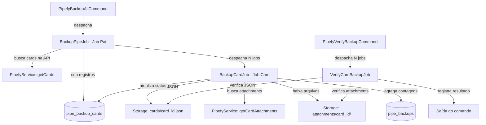

# Documento de Design: Backup Granular de Cards

## Visão Geral

Esta funcionalidade refatora o sistema de backup do Pipefy para processar cada card como um job individual na fila, substituindo o processamento sequencial monolítico atual. Adicionalmente, introduz um comando de verificação de integridade que valida os arquivos de backup em disco sem consultar a API.

O fluxo atual (`BackupPipeJob` → `PipefyBackupCardsCommand` processando todos os cards sequencialmente) será substituído por uma arquitetura de dois níveis: um job pai que busca a lista de cards e despacha jobs individuais, e jobs filhos que processam cada card independentemente.

## Arquitetura



### Decisões de Design

1. **Job pai mantém a responsabilidade de buscar cards na API**: O `BackupPipeJob` continua sendo o ponto de entrada por pipe, mas agora apenas busca a lista de cards e despacha jobs individuais, em vez de processar tudo.

2. **Agregação de status via contagem no banco**: Em vez de usar Laravel Bus/Batch (que adicionaria complexidade), o status do pipe é derivado dos status individuais dos cards via queries simples. Isso mantém a simplicidade e permite consultas diretas.

3. **Reutilização do PipefyService existente**: Os métodos `getCards()` e `getCardAttachments()` já existem e serão reutilizados sem modificação.

4. **Verificação offline**: O comando de verificação opera exclusivamente sobre arquivos locais, usando o `index.json` já gerado pelo backup como fonte de verdade para a lista de cards.

5. **Status `completed_with_errors`**: Novo status para diferenciar backups que concluíram mas tiveram falhas parciais (ex: attachment não baixou) de backups completamente bem-sucedidos.

## Componentes e Interfaces

### BackupPipeJob (Refatorado)

O job existente será refatorado para atuar como "job pai":

```php
class BackupPipeJob implements ShouldQueue
{
    use Queueable;

    public int $tries = 3;
    public array $backoff = [30, 60, 120];

    public function __construct(
        public int $pipeBackupId,
        public int $pipeId,
    ) {}

    public function handle(PipefyService $pipefy): void
    {
        $pipeBackup = PipeBackup::findOrFail($this->pipeBackupId);
        $pipeBackup->update(['status' => 'processing', 'started_at' => now()]);

        $cards = $pipefy->getCards($this->pipeId);
        $pipeBackup->update(['total_cards' => count($cards)]);

        if (empty($cards)) {
            $pipeBackup->update(['status' => 'completed', 'completed_at' => now()]);
            return;
        }

        foreach ($cards as $card) {
            $backupCard = PipeBackupCard::create([
                'pipe_backup_id' => $pipeBackup->id,
                'card_id' => (int) $card['id'],
                'card_title' => $card['title'] ?? '',
                'status' => 'pending',
            ]);

            BackupCardJob::dispatch(
                $backupCard->id,
                $this->pipeId,
                $card,
            );
        }
    }

    public function failed(\Throwable $exception): void
    {
        $pipeBackup = PipeBackup::find($this->pipeBackupId);
        $pipeBackup?->update([
            'status' => 'failed',
            'error_message' => $exception->getMessage(),
            'completed_at' => now(),
        ]);
    }
}
```

### BackupCardJob (Novo)

```php
class BackupCardJob implements ShouldQueue
{
    use Queueable;

    public int $tries = 3;
    public array $backoff = [30, 60, 120];

    public function __construct(
        public int $pipeBackupCardId,
        public int $pipeId,
        public array $cardData,
    ) {}

    public function handle(PipefyService $pipefy): void
    {
        $backupCard = PipeBackupCard::findOrFail($this->pipeBackupCardId);
        $backupCard->update(['status' => 'processing', 'started_at' => now()]);

        $cardId = (int) $this->cardData['id'];
        $hasErrors = false;

        // Salvar JSON do card
        $attachments = [];
        try {
            $attachments = $pipefy->getCardAttachments($cardId);
        } catch (\Throwable $e) {
            $hasErrors = true;
            $this->recordError($backupCard, 'attachment_query', $cardId, null, $e->getMessage());
        }

        $this->cardData['attachments'] = $attachments;
        Storage::disk('local')->put(
            "pipefy-backup/{$this->pipeId}/cards/{$cardId}.json",
            json_encode($this->cardData, JSON_PRETTY_PRINT | JSON_UNESCAPED_UNICODE),
        );

        // Baixar attachments
        $attachmentsDownloaded = 0;
        foreach ($attachments as $attachment) {
            try {
                $this->downloadAttachment($attachment, $cardId);
                $attachmentsDownloaded++;
            } catch (\Throwable $e) {
                $hasErrors = true;
                $this->recordError($backupCard, 'attachment_download', $cardId, $attachment['filename'], $e->getMessage());
            }
        }

        $backupCard->update([
            'status' => $hasErrors ? 'completed_with_errors' : 'completed',
            'attachments_count' => $attachmentsDownloaded,
            'errors_count' => $backupCard->fresh()->pipeBackupErrors()->count(),
            'completed_at' => now(),
        ]);

        $this->aggregatePipeBackupStatus($backupCard->pipe_backup_id);
    }

    public function failed(\Throwable $exception): void
    {
        $backupCard = PipeBackupCard::find($this->pipeBackupCardId);
        if ($backupCard) {
            $backupCard->update([
                'status' => 'failed',
                'error_message' => $exception->getMessage(),
                'completed_at' => now(),
            ]);
            $this->aggregatePipeBackupStatus($backupCard->pipe_backup_id);
        }
    }
}
```

### PipefyVerifyBackupCommand (Novo)

```php
class PipefyVerifyBackupCommand extends Command
{
    protected $signature = 'pipefy:verify-backup {pipe_id}';

    public function handle(): int
    {
        $pipeId = (int) $this->argument('pipe_id');
        $indexPath = "pipefy-backup/{$pipeId}/cards/index.json";

        if (!Storage::disk('local')->exists($indexPath)) {
            $this->error("Arquivo index.json não encontrado para o pipe {$pipeId}.");
            return self::FAILURE;
        }

        $index = json_decode(Storage::disk('local')->get($indexPath), true);
        $cards = $index['cards'] ?? [];

        foreach ($cards as $card) {
            VerifyCardBackupJob::dispatch($pipeId, (int) $card['id'], $card['title'] ?? '');
        }

        $this->info("Despachados " . count($cards) . " jobs de verificação.");
        return self::SUCCESS;
    }
}
```

### VerifyCardBackupJob (Novo)

```php
class VerifyCardBackupJob implements ShouldQueue
{
    use Queueable;

    public function __construct(
        public int $pipeId,
        public int $cardId,
        public string $cardTitle,
    ) {}

    public function handle(): void
    {
        $issues = [];

        // Verificar JSON do card
        $jsonPath = "pipefy-backup/{$this->pipeId}/cards/{$this->cardId}.json";
        if (!Storage::disk('local')->exists($jsonPath)) {
            Log::warning("Verificação: Card JSON ausente - pipe:{$this->pipeId} card:{$this->cardId}");
            return;
        }

        $content = Storage::disk('local')->get($jsonPath);
        $cardData = json_decode($content, true);
        if (json_last_error() !== JSON_ERROR_NONE || empty($cardData)) {
            Log::warning("Verificação: Card JSON inválido - pipe:{$this->pipeId} card:{$this->cardId}");
            return;
        }

        // Verificar attachments
        $attachments = $cardData['attachments'] ?? [];
        foreach ($attachments as $attachment) {
            $filename = $attachment['filename'] ?? basename($attachment['path'] ?? '');
            $attachmentPath = "pipefy-backup/{$this->pipeId}/attachments/{$this->cardId}/{$filename}";
            if (!Storage::disk('local')->exists($attachmentPath)) {
                Log::warning("Verificação: Attachment ausente - pipe:{$this->pipeId} card:{$this->cardId} file:{$filename}");
            }
        }
    }
}
```

### Método de Agregação de Status

```php
private function aggregatePipeBackupStatus(int $pipeBackupId): void
{
    $pipeBackup = PipeBackup::findOrFail($pipeBackupId);
    $cards = $pipeBackup->backupCards();

    $pipeBackup->update([
        'cards_count' => $cards->whereIn('status', ['completed', 'completed_with_errors'])->count(),
        'attachments_count' => $cards->sum('attachments_count'),
        'errors_count' => $cards->sum('errors_count'),
    ]);

    $pendingOrProcessing = $cards->whereIn('status', ['pending', 'processing'])->count();
    if ($pendingOrProcessing === 0) {
        $hasFailed = $cards->where('status', 'failed')->count() > 0;
        $pipeBackup->update([
            'status' => $hasFailed ? 'completed_with_errors' : 'completed',
            'completed_at' => now(),
        ]);
    }
}
```

## Modelos de Dados

### Tabela `pipe_backup_cards` (Nova)

| Campo             | Tipo                 | Descrição                                                     |
| ----------------- | -------------------- | ------------------------------------------------------------- |
| id                | bigint (PK)          | Identificador auto-incremento                                 |
| pipe_backup_id    | bigint (FK)          | Referência ao PipeBackup pai                                  |
| card_id           | unsigned int         | ID do card no Pipefy                                          |
| card_title        | string               | Título do card                                                |
| status            | string(30)           | pending, processing, completed, completed_with_errors, failed |
| attachments_count | unsigned int         | Quantidade de attachments baixados                            |
| errors_count      | unsigned int         | Quantidade de erros                                           |
| error_message     | text (nullable)      | Mensagem de erro em caso de falha                             |
| started_at        | timestamp (nullable) | Início do processamento                                       |
| completed_at      | timestamp (nullable) | Fim do processamento                                          |
| created_at        | timestamp            | Criação do registro                                           |
| updated_at        | timestamp            | Última atualização                                            |

Índices: `pipe_backup_id`, `(pipe_backup_id, status)`

### Modelo PipeBackupCard

```php
class PipeBackupCard extends Model
{
    protected $fillable = [
        'pipe_backup_id', 'card_id', 'card_title',
        'status', 'attachments_count', 'errors_count',
        'error_message', 'started_at', 'completed_at',
    ];

    protected function casts(): array
    {
        return [
            'card_id' => 'integer',
            'attachments_count' => 'integer',
            'errors_count' => 'integer',
            'started_at' => 'datetime',
            'completed_at' => 'datetime',
        ];
    }

    public function pipeBackup(): BelongsTo
    {
        return $this->belongsTo(PipeBackup::class);
    }

    public function pipeBackupErrors(): HasMany
    {
        return $this->hasMany(PipeBackupError::class);
    }
}
```

### Alterações no PipeBackup (Existente)

Adicionar relação `backupCards()`:

```php
public function backupCards(): HasMany
{
    return $this->hasMany(PipeBackupCard::class);
}
```

### Alterações no PipeBackupError (Existente)

Adicionar campo opcional `pipe_backup_card_id` para vincular erros a cards específicos:

```php
// Nova migration: adicionar pipe_backup_card_id
$table->foreignId('pipe_backup_card_id')->nullable()->constrained('pipe_backup_cards')->nullOnDelete();
```

### Estrutura de Arquivos em Disco (Sem Alteração)

```
storage/app/private/pipefy-backup/{pipe_id}/
├── cards/
│   ├── index.json
│   ├── {card_id}.json
│   └── ...
└── attachments/
    ├── {card_id}/
    │   ├── arquivo1.pdf
    │   └── arquivo2.png
    └── ...
```

## Propriedades de Corretude

_Uma propriedade é uma característica ou comportamento que deve ser verdadeiro em todas as execuções válidas de um sistema — essencialmente, uma declaração formal sobre o que o sistema deve fazer. Propriedades servem como ponte entre especificações legíveis por humanos e garantias de corretude verificáveis por máquina._

### Property 1: Despacho do Job Pai cria registros e jobs proporcionais

_Para qualquer_ lista de N cards retornada pela API do Pipefy, quando o BackupPipeJob for executado, o sistema deve criar exatamente N registros PipeBackupCard com status "pending" e despachar exatamente N BackupCardJob. O campo total_cards do PipeBackup deve ser igual a N.

**Validates: Requirements 1.1, 1.2**

### Property 2: Card JSON é salvo corretamente no disco

_Para qualquer_ card com dados válidos, quando o BackupCardJob for executado com sucesso, o arquivo `pipefy-backup/{pipe_id}/cards/{card_id}.json` deve existir no disco e seu conteúdo decodificado como JSON deve conter os mesmos dados do card original (incluindo id e title).

**Validates: Requirements 2.1**

### Property 3: Attachments são baixados para os caminhos corretos

_Para qualquer_ card com N attachments retornados pela API, quando o BackupCardJob for executado com sucesso, devem existir exatamente N arquivos no diretório `pipefy-backup/{pipe_id}/attachments/{card_id}/`, um para cada attachment.

**Validates: Requirements 2.2**

### Property 4: Falha em um attachment não bloqueia os demais

_Para qualquer_ card com N attachments onde K deles falham no download (0 < K < N), o BackupCardJob deve baixar com sucesso os (N - K) attachments restantes e registrar exatamente K erros no PipeBackupError.

**Validates: Requirements 2.4**

### Property 5: Status do pipe é derivado corretamente dos status dos cards

_Para qualquer_ PipeBackup com cards em estados terminais, se todos os cards estiverem "completed" ou "completed_with_errors" e nenhum estiver "failed", o PipeBackup deve ter status "completed". Se pelo menos um card estiver "failed" e nenhum estiver "pending" ou "processing", o PipeBackup deve ter status "completed_with_errors". As contagens agregadas (cards_count, attachments_count, errors_count) devem ser iguais à soma dos valores individuais dos cards.

**Validates: Requirements 3.2, 3.3, 3.4**

### Property 6: Retry reprocessa apenas cards com falha

_Para qualquer_ PipeBackup com uma mistura de cards "completed" e "failed", quando o retry for solicitado, apenas os cards com status "failed" devem ter seu status resetado para "pending" e receber novos jobs despachados. Cards com status "completed" devem permanecer inalterados. O PipeBackup deve ter status "processing".

**Validates: Requirements 4.1, 4.2, 4.3**

### Property 7: Verificação detecta JSON e attachments corretamente

_Para qualquer_ card com backup em disco, o Job_Verificação deve reportar sucesso se e somente se: (a) o arquivo JSON existe e contém JSON válido não vazio, e (b) todos os attachments referenciados no JSON possuem arquivos correspondentes em disco.

**Validates: Requirements 5.2, 5.3**

### Property 8: API de status retorna contagens corretas por status de card

_Para qualquer_ PipeBackup com N cards distribuídos entre os status possíveis, a API de status deve retornar contagens que somam exatamente N e correspondem à contagem real de cada status no banco de dados.

**Validates: Requirements 6.1, 6.2**

## Tratamento de Erros

| Cenário                                      | Comportamento                                                   | Registro                                       |
| -------------------------------------------- | --------------------------------------------------------------- | ---------------------------------------------- |
| API falha ao buscar lista de cards           | BackupPipeJob marca PipeBackup como "failed"                    | error_message no PipeBackup                    |
| API falha ao buscar attachments de um card   | Card JSON salvo sem attachments, status "completed_with_errors" | PipeBackupError com type "attachment_query"    |
| Download de attachment individual falha      | Continua com próximos attachments, incrementa errors_count      | PipeBackupError com type "attachment_download" |
| Salvamento do card JSON falha                | PipeBackupCard marcado como "failed"                            | error_message no PipeBackupCard                |
| BackupCardJob falha após todas as tentativas | PipeBackupCard marcado como "failed" via método `failed()`      | error_message no PipeBackupCard                |
| index.json não encontrado na verificação     | Comando retorna FAILURE com mensagem                            | Output do comando                              |
| Card JSON ausente na verificação             | Registrado como falha de verificação                            | Log warning                                    |
| Attachment ausente na verificação            | Registrado como falha de verificação                            | Log warning                                    |

### Política de Retry

- **BackupPipeJob**: 3 tentativas com backoff [30, 60, 120] segundos (mantém comportamento atual)
- **BackupCardJob**: 3 tentativas com backoff [30, 60, 120] segundos
- **VerifyCardBackupJob**: 1 tentativa (verificação local, sem necessidade de retry)

## Estratégia de Testes

### Abordagem Dual

A estratégia combina testes unitários (exemplos específicos e edge cases) com testes baseados em propriedades (validação universal):

- **Testes unitários (PHPUnit)**: Validam exemplos concretos, edge cases e condições de erro
- **Testes de propriedade (PHPUnit + geração de dados)**: Validam propriedades universais com múltiplas iterações

### Biblioteca de Testes de Propriedade

Utilizaremos o PHPUnit com factories do Laravel para gerar dados variados. Cada teste de propriedade executará no mínimo 100 iterações com dados gerados aleatoriamente usando `fake()` e factories.

### Configuração dos Testes de Propriedade

- Mínimo de 100 iterações por teste de propriedade
- Cada teste deve referenciar a propriedade do design com um comentário
- Formato do tag: `Feature: granular-card-backup, Property {number}: {título}`
- Cada propriedade de corretude deve ser implementada por um único teste

### Cobertura de Testes

| Componente                 | Testes Unitários                              | Testes de Propriedade                               |
| -------------------------- | --------------------------------------------- | --------------------------------------------------- |
| BackupPipeJob (refatorado) | Edge cases (0 cards, API failure)             | Property 1 (despacho proporcional)                  |
| BackupCardJob              | Exemplos de sucesso/falha                     | Properties 2, 3, 4 (JSON, attachments, resiliência) |
| Agregação de status        | Exemplos específicos                          | Property 5 (derivação de status)                    |
| Retry                      | Edge case (nada para retry)                   | Property 6 (retry seletivo)                         |
| Verificação                | Exemplos de JSON inválido, attachment ausente | Property 7 (verificação correta)                    |
| API de status              | Formato de resposta                           | Property 8 (contagens corretas)                     |
