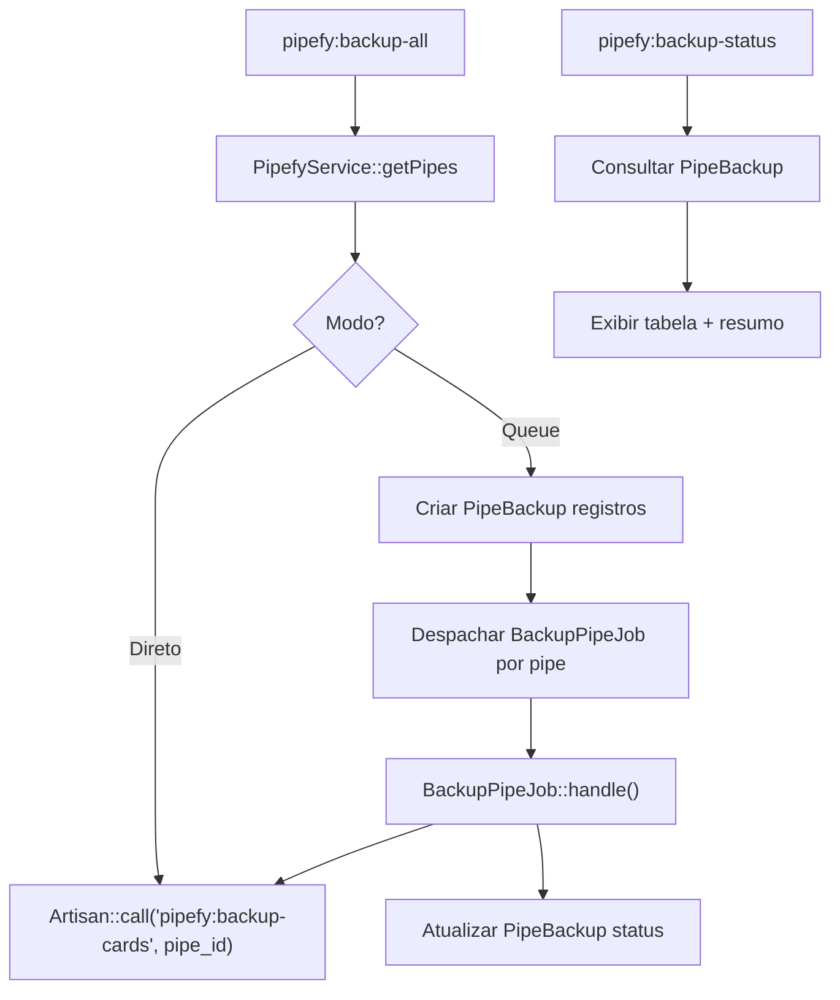
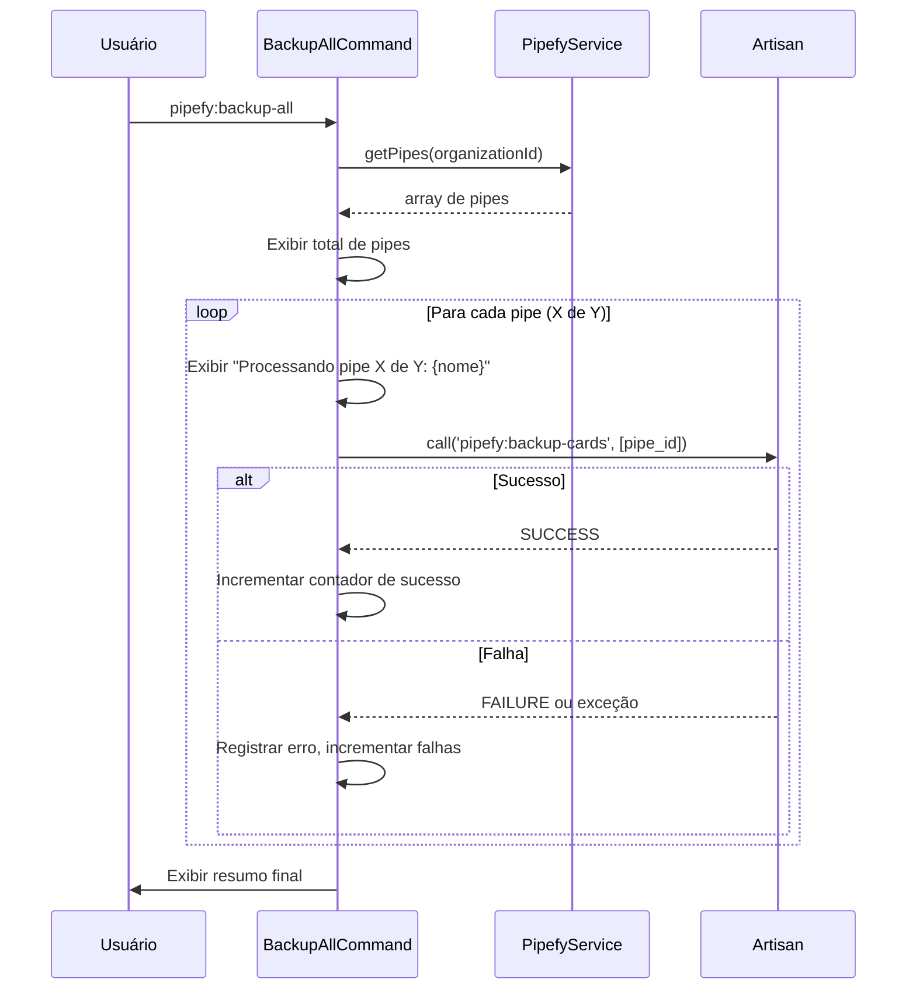
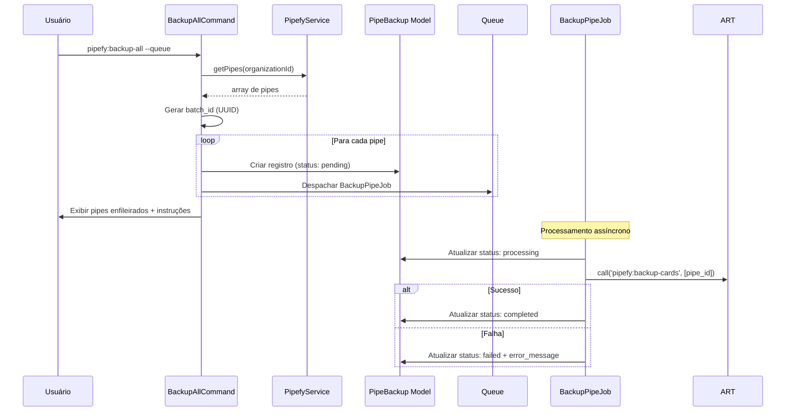

# Documento de Design

## Visão Geral

Este design descreve a implementação do backup completo de todos os pipes de uma organização no Pipefy. A funcionalidade adiciona dois novos comandos Artisan (`pipefy:backup-all` e `pipefy:backup-status`), um Job Laravel (`BackupPipeJob`) e um Model Eloquent (`PipeBackup`) para rastreamento de status.

O fluxo principal é:

1. O comando `pipefy:backup-all` obtém o ID da organização da configuração
2. Lista todos os pipes via `PipefyService::getPipes()`
3. No Modo Direto: itera sequencialmente sobre cada pipe, chamando a lógica de backup do `PipefyBackupCardsCommand` via `Artisan::call()`
4. No Modo Fila: cria registros de status no banco e despacha um `BackupPipeJob` para cada pipe
5. O `pipefy:backup-status` consulta o `PipeBackup` model para exibir o progresso

A lógica de backup por pipe já existe no `PipefyBackupCardsCommand` e é reutilizada integralmente — não há duplicação de código.

## Arquitetura



Fluxo detalhado do Modo Direto:



Fluxo detalhado do Modo Fila:



## Componentes e Interfaces

### 1. Model `PipeBackup` (`app/Models/PipeBackup.php`)

```php
class PipeBackup extends Model
{
    protected $fillable = [
        'batch_id',
        'pipe_id',
        'pipe_name',
        'status',
        'error_message',
        'started_at',
        'completed_at',
    ];

    protected function casts(): array
    {
        return [
            'pipe_id' => 'integer',
            'started_at' => 'datetime',
            'completed_at' => 'datetime',
        ];
    }
}
```

Status possíveis: `pending`, `processing`, `completed`, `failed`.

### 2. Migration `create_pipe_backups_table`

```php
Schema::create('pipe_backups', function (Blueprint $table) {
    $table->id();
    $table->string('batch_id', 36)->index();
    $table->unsignedInteger('pipe_id');
    $table->string('pipe_name');
    $table->string('status', 20)->default('pending');
    $table->text('error_message')->nullable();
    $table->timestamp('started_at')->nullable();
    $table->timestamp('completed_at')->nullable();
    $table->timestamps();

    $table->index(['batch_id', 'status']);
});
```

### 3. Job `BackupPipeJob` (`app/Jobs/BackupPipeJob.php`)

```php
class BackupPipeJob implements ShouldQueue
{
    use Queueable;

    public function __construct(
        public int $pipeBackupId,
        public int $pipeId,
    ) {}

    public function handle(): void
    {
        $pipeBackup = PipeBackup::findOrFail($this->pipeBackupId);
        $pipeBackup->update([
            'status' => 'processing',
            'started_at' => now(),
        ]);

        try {
            $exitCode = Artisan::call('pipefy:backup-cards', [
                'pipe_id' => $this->pipeId,
            ]);

            if ($exitCode !== 0) {
                throw new \RuntimeException('Comando pipefy:backup-cards retornou código de erro: ' . $exitCode);
            }

            $pipeBackup->update([
                'status' => 'completed',
                'completed_at' => now(),
            ]);
        } catch (\Throwable $e) {
            Log::error("Falha no backup do pipe {$this->pipeId}: {$e->getMessage()}");
            $pipeBackup->update([
                'status' => 'failed',
                'error_message' => $e->getMessage(),
                'completed_at' => now(),
            ]);
        }
    }
}
```

### 4. Comando `PipefyBackupAllCommand` (`app/Console/Commands/PipefyBackupAllCommand.php`)

```php
class PipefyBackupAllCommand extends Command
{
    protected $signature = 'pipefy:backup-all {--queue : Despachar backups para a fila}';
    protected $description = 'Faz backup de todos os pipes da organização no Pipefy';

    public function handle(PipefyService $pipefy): int
}
```

O método `handle()`:

1. Obtém `organization_id` de `config('services.pipefy.organization_id')`
2. Valida que a configuração existe
3. Chama `$pipefy->getPipes($organizationId)` para listar pipes
4. Se `--queue` está presente: chama `handleQueue($pipes)`
5. Caso contrário: chama `handleDirect($pipes, $pipefy)`

**Modo Direto** (`handleDirect`):

- Registra o tempo de início
- Itera sobre cada pipe com output de progresso: "Processando pipe X de Y: {nome} (ID: {id})"
- Chama `Artisan::call('pipefy:backup-cards', ['pipe_id' => $pipe['id']])` para cada pipe
- Captura exceções e falhas (exit code != 0), registra no log, exibe aviso, continua
- Exibe resumo final com totais e tempo de execução

**Modo Fila** (`handleQueue`):

- Gera um `batch_id` via `Str::uuid()`
- Para cada pipe, cria um registro `PipeBackup` com status `pending`
- Despacha `BackupPipeJob` para cada pipe
- Exibe tabela com pipes enfileirados
- Exibe instruções: "Execute `php artisan pipefy:backup-status` para acompanhar o progresso."

### 5. Comando `PipefyBackupStatusCommand` (`app/Console/Commands/PipefyBackupStatusCommand.php`)

```php
class PipefyBackupStatusCommand extends Command
{
    protected $signature = 'pipefy:backup-status';
    protected $description = 'Exibe o status dos backups de pipes do Pipefy';

    public function handle(): int
}
```

O método `handle()`:

1. Busca o `batch_id` mais recente: `PipeBackup::latest()->value('batch_id')`
2. Se não houver registros, exibe mensagem informativa e retorna sucesso
3. Busca todos os registros do lote: `PipeBackup::where('batch_id', $batchId)->get()`
4. Exibe tabela com colunas: Pipe ID, Nome, Status, Início, Conclusão, Erro
5. Exibe resumo: total, completados, em processamento, pendentes, com falha

## Modelos de Dados

### Tabela `pipe_backups`

| Coluna        | Tipo             | Descrição                                      |
| ------------- | ---------------- | ---------------------------------------------- |
| id            | bigint (PK)      | Identificador auto-incremento                  |
| batch_id      | string(36)       | UUID do lote de backup (indexado)              |
| pipe_id       | unsigned integer | ID do pipe no Pipefy                           |
| pipe_name     | string           | Nome do pipe no Pipefy                         |
| status        | string(20)       | Status: pending, processing, completed, failed |
| error_message | text (nullable)  | Mensagem de erro quando status = failed        |
| started_at    | timestamp (null) | Timestamp de início do processamento           |
| completed_at  | timestamp (null) | Timestamp de conclusão do processamento        |
| created_at    | timestamp        | Timestamp de criação do registro               |
| updated_at    | timestamp        | Timestamp de última atualização                |

### Estrutura de Pipes (retornado por `getPipes`)

```php
[
    ['id' => 123, 'name' => 'Pipe de Vendas'],
    ['id' => 456, 'name' => 'Pipe de Suporte'],
]
```

## Propriedades de Corretude

_Uma propriedade é uma característica ou comportamento que deve ser verdadeiro em todas as execuções válidas de um sistema — essencialmente, uma declaração formal sobre o que o sistema deve fazer. Propriedades servem como ponte entre especificações legíveis por humanos e garantias de corretude verificáveis por máquina._

### Propriedade 1: Modo direto processa todos os pipes

_Para qualquer_ conjunto de pipes retornado por `getPipes()`, o Modo Direto deve chamar `Artisan::call('pipefy:backup-cards', ['pipe_id' => $id])` exatamente uma vez para cada pipe, na ordem recebida.

**Valida: Requisitos 2.1**

### Propriedade 2: Progresso do modo direto no terminal

_Para qualquer_ conjunto de N pipes, a saída do terminal no Modo Direto deve conter, para cada pipe na posição X, uma string indicando "pipe X de N" e o nome do pipe.

**Valida: Requisitos 2.2**

### Propriedade 3: Resiliência no modo direto

_Para qualquer_ conjunto de pipes onde um subconjunto falha durante o backup, o Comando_BackupAll no Modo Direto deve tentar processar todos os pipes restantes — o número total de tentativas de backup deve ser igual ao número total de pipes.

**Valida: Requisitos 2.3, 6.1**

### Propriedade 4: Precisão do resumo no modo direto

_Para qualquer_ conjunto de pipes com S sucessos e F falhas (onde S + F = total), o resumo final do Modo Direto deve exibir exatamente S como pipes com sucesso e F como pipes com falha.

**Valida: Requisitos 2.4, 6.3**

### Propriedade 5: Modo fila despacha um job por pipe

_Para qualquer_ conjunto de N pipes, o Modo Fila deve despachar exatamente N instâncias de `BackupPipeJob`, cada uma com o `pipeId` correspondente.

**Valida: Requisitos 3.1**

### Propriedade 6: Registros pendentes com mesmo batch_id

_Para qualquer_ conjunto de pipes despachados no Modo Fila, todos os registros `PipeBackup` criados devem ter o mesmo `batch_id`, status `pending` e os `pipe_id`/`pipe_name` correspondentes a cada pipe.

**Valida: Requisitos 4.5**

### Propriedade 7: Transições de estado do job

_Para qualquer_ `BackupPipeJob`, ao iniciar o processamento o status deve transicionar para `processing` com `started_at` preenchido. Ao concluir com sucesso, o status deve ser `completed` com `completed_at` preenchido. Ao falhar, o status deve ser `failed` com `error_message` preenchido e `completed_at` preenchido.

**Valida: Requisitos 4.2, 4.3, 4.4**

### Propriedade 8: Precisão do comando de status

_Para qualquer_ conjunto de registros `PipeBackup` com distribuição aleatória de status (pending, processing, completed, failed), o Comando_BackupStatus deve exibir contagens de resumo que correspondam exatamente à distribuição real dos registros.

**Valida: Requisitos 5.2, 5.3**

### Propriedade 9: Saída do modo fila contém informações dos pipes

_Para qualquer_ conjunto de pipes despachados no Modo Fila, a saída do terminal deve conter o ID e o nome de cada pipe enfileirado.

**Valida: Requisitos 3.2**

## Tratamento de Erros

| Cenário                                       | Ação                                                       | Interrompe processo? |
| --------------------------------------------- | ---------------------------------------------------------- | -------------------- |
| `organization_id` não configurado             | Exibir erro, retornar `Command::FAILURE`                   | Sim                  |
| Falha ao consultar pipes da organização       | Exibir erro, retornar `Command::FAILURE`                   | Sim                  |
| Organização com zero pipes                    | Exibir mensagem informativa, retornar `Command::SUCCESS`   | Sim (sem erro)       |
| Falha no backup de um pipe (Modo Direto)      | Registrar no log, exibir aviso, continuar com próximo pipe | Não                  |
| Falha no `BackupPipeJob` (Modo Fila)          | Atualizar status para `failed`, registrar no log           | Não                  |
| Nenhum registro de backup encontrado (Status) | Exibir mensagem informativa, retornar `Command::SUCCESS`   | Sim (sem erro)       |

**Erros fatais** (interrompem o comando): configuração ausente, falha na listagem de pipes.

**Erros parciais** (não interrompem): falha no backup de pipes individuais. O resumo final (Modo Direto) ou o comando de status (Modo Fila) exibe a contagem de falhas.

## Estratégia de Testes

### Abordagem

Utilizamos uma abordagem dual de testes:

- **Testes unitários (PHPUnit)**: Verificam exemplos específicos, edge cases e condições de erro
- **Testes de propriedade (PHPUnit com Faker)**: Verificam propriedades universais com múltiplas entradas geradas

Ambos são complementários e necessários para cobertura abrangente.

### Biblioteca de Testes

- **PHPUnit v11** para todos os testes
- **Faker** para geração de dados aleatórios nos testes de propriedade (mínimo 100 iterações)
- **Laravel Queue Fake** para verificar despacho de jobs
- **Laravel Artisan Fake / expectsCommand** para verificar chamadas ao `pipefy:backup-cards`
- **SQLite in-memory** para testes com o model `PipeBackup`

Cada teste de propriedade deve referenciar a propriedade do design com o formato:
**Feature: pipefy-backup-all, Property {número}: {título}**

### Testes de Propriedade

| Propriedade | Descrição                           | Abordagem                                                                                                    |
| ----------- | ----------------------------------- | ------------------------------------------------------------------------------------------------------------ |
| 1           | Modo direto processa todos os pipes | Gerar N pipes aleatórios, mockar Artisan::call, verificar que foi chamado N vezes com os pipe_ids corretos   |
| 2           | Progresso no terminal               | Gerar N pipes com nomes aleatórios, executar comando, verificar que output contém "pipe X de N" para cada X  |
| 3           | Resiliência no modo direto          | Gerar N pipes, fazer subset aleatório falhar, verificar que todos N foram tentados                           |
| 4           | Precisão do resumo                  | Gerar N pipes com S sucessos e F falhas aleatórios, verificar contagens no output                            |
| 5           | Modo fila despacha jobs             | Gerar N pipes, executar com --queue, verificar N jobs despachados via Queue::fake                            |
| 6           | Registros pendentes com batch_id    | Gerar N pipes, executar com --queue, verificar N registros PipeBackup com mesmo batch_id e status pending    |
| 7           | Transições de estado do job         | Gerar pipe aleatório, executar BackupPipeJob com mock de sucesso/falha, verificar transições de status       |
| 8           | Precisão do comando de status       | Gerar registros PipeBackup com status aleatórios, executar backup-status, verificar contagens no output      |
| 9           | Saída do modo fila                  | Gerar N pipes com nomes aleatórios, executar com --queue, verificar que output contém ID e nome de cada pipe |

### Testes Unitários

Focados em edge cases e exemplos específicos:

- Comando usa `organization_id` da configuração (Requisito 1.1)
- Organização com zero pipes exibe mensagem e retorna sucesso (Requisito 1.3)
- Configuração `organization_id` ausente retorna FAILURE (Requisito 1.4)
- Erro ao consultar pipes retorna FAILURE (Requisito 1.5)
- Modo fila exibe instruções para `pipefy:backup-status` (Requisito 3.3)
- Job chama `pipefy:backup-cards` com pipe_id correto (Requisito 3.4)
- Job atualiza status para failed quando backup falha (Requisito 3.5)
- Model PipeBackup possui campos e casts corretos (Requisito 4.1)
- Comando `pipefy:backup-status` está registrado (Requisito 5.1)
- Nenhum registro de backup exibe mensagem informativa (Requisito 5.4)
