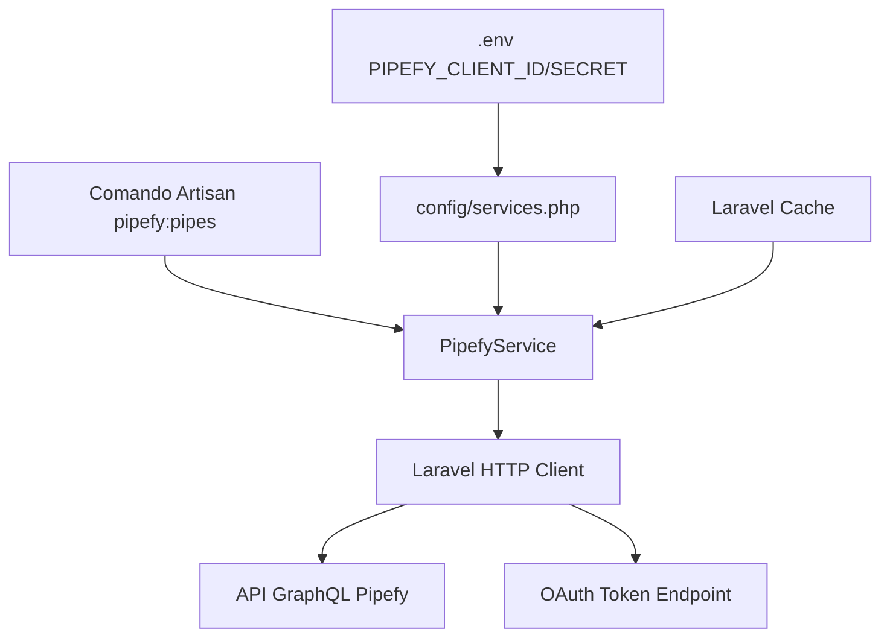

# Documento de Design

## Visão Geral

Este design descreve a implementação da funcionalidade de conexão e listagem de pipes do Pipefy em uma aplicação Laravel 12. O sistema utiliza o HTTP Client nativo do Laravel para comunicação com a API GraphQL do Pipefy, expondo a funcionalidade via comando Artisan.

A arquitetura segue o padrão de serviço do Laravel: uma classe de serviço encapsula toda a lógica de comunicação com a API, registrada no container via Service Provider, e consumida por um comando Artisan.

## Arquitetura



O fluxo é simples e direto:

1. O comando Artisan recebe a intenção do usuário
2. O `PipefyService` obtém um access token OAuth2 via Client Credentials (cacheado)
3. O `PipefyService` executa queries GraphQL via HTTP Client do Laravel
4. As respostas são parseadas e retornadas como arrays associativos
5. O comando formata e exibe os dados no terminal

## Componentes e Interfaces

### 1. Configuração (`config/services.php`)

Adicionar entrada `pipefy` no arquivo de configuração de serviços existente:

```php
'pipefy' => [
    'client_id' => env('PIPEFY_CLIENT_ID'),
    'client_secret' => env('PIPEFY_CLIENT_SECRET'),
    'token_url' => env('PIPEFY_TOKEN_URL', 'https://app.pipefy.com/oauth/token'),
    'endpoint' => env('PIPEFY_API_ENDPOINT', 'https://api.pipefy.com/graphql'),
],
```

### 2. PipefyService (`app/Services/PipefyService.php`)

Classe de serviço responsável por toda comunicação com a API GraphQL. Obtém o access token via OAuth2 Client Credentials automaticamente, cacheando pelo tempo de expiração.

```php
class PipefyService
{
    public function __construct(
        private string $clientId,
        private string $clientSecret,
        private string $tokenUrl,
        private string $endpoint,
    ) {}

    /**
     * Obtém um access token OAuth2 via Client Credentials grant.
     * O token é cacheado pelo tempo de expiração retornado pela API.
     *
     * @return string
     *
     * @throws PipefyApiException
     */
    private function getAccessToken(): string

    /**
     * Executa uma query GraphQL na API do Pipefy.
     *
     * @param string $query
     * @param array<string, mixed> $variables
     * @return array<string, mixed>
     *
     * @throws PipefyApiException
     */
    public function query(string $query, array $variables = []): array

    /**
     * Retorna as organizações do usuário.
     *
     * @return array<int, array{id: int, name: string}>
     */
    public function getOrganizations(): array

    /**
     * Retorna os pipes de uma organização.
     *
     * @param int $organizationId
     * @return array<int, array{id: int, name: string}>
     */
    public function getPipes(int $organizationId): array
}
```

### 3. PipefyApiException (`app/Exceptions/PipefyApiException.php`)

Exceção customizada para erros da API do Pipefy. Encapsula erros de autenticação, rede, resposta inválida e erros GraphQL.

```php
class PipefyApiException extends RuntimeException
{
    public static function missingToken(): self
    public static function oauthError(string $message): self
    public static function connectionError(string $message): self
    public static function invalidResponse(string $message): self
    public static function graphqlErrors(array $errors): self
    public static function httpError(int $statusCode, string $body): self
}
```

### 4. Comando Artisan (`app/Console/Commands/PipefyPipesCommand.php`)

Comando `pipefy:pipes` que lista pipes de uma organização.

```php
class PipefyPipesCommand extends Command
{
    protected $signature = 'pipefy:pipes';
    protected $description = 'Lista os pipes disponíveis no Pipefy';

    public function handle(PipefyService $pipefy): int
}
```

O comando:

1. Busca organizações via `PipefyService::getOrganizations()`
2. Apresenta seleção interativa usando `Laravel\Prompts\select()`
3. Busca pipes da organização selecionada via `PipefyService::getPipes()`
4. Exibe resultado em tabela com colunas ID e Nome

### 5. Registro no Service Provider (`app/Providers/AppServiceProvider.php`)

Registrar o `PipefyService` como singleton no container:

```php
$this->app->singleton(PipefyService::class, function ($app) {
    $config = config('services.pipefy');

    if (empty($config['client_id']) || empty($config['client_secret'])) {
        throw PipefyApiException::missingToken();
    }

    return new PipefyService(
        $config['client_id'],
        $config['client_secret'],
        $config['token_url'],
        $config['endpoint'],
    );
});
```

## Modelos de Dados

Não há modelos Eloquent nesta fase. Os dados são representados como arrays associativos PHP retornados pela API.

### Estruturas de Dados

**Resposta da API GraphQL:**

```php
// Resposta de sucesso
['data' => ['organizations' => [['id' => 1, 'name' => 'Minha Org']]]]

// Resposta com erro
['errors' => [['message' => 'Unauthorized']]]
```

**Organização:**

```php
['id' => int, 'name' => string]
```

**Pipe:**

```php
['id' => int, 'name' => string]
```

### Queries GraphQL

**Listar Organizações:**

```graphql
{
    organizations {
        id
        name
    }
}
```

**Listar Pipes de uma Organização:**

```graphql
{
    organization(id: $id) {
        pipes {
            id
            name
        }
    }
}
```

## Propriedades de Corretude

_Uma propriedade é uma característica ou comportamento que deve ser verdadeiro em todas as execuções válidas de um sistema — essencialmente, uma declaração formal sobre o que o sistema deve fazer. Propriedades servem como ponte entre especificações legíveis por humanos e garantias de corretude verificáveis por máquina._

### Propriedade 1: Formato das requisições à API

_Para qualquer_ query GraphQL enviada pelo Serviço_Pipefy, a requisição deve ser do tipo POST, conter o cabeçalho `Content-Type: application/json` e conter o cabeçalho `Authorization: Bearer {token}` com o token configurado.

**Valida: Requisitos 1.3, 2.1**

### Propriedade 2: Parsing de respostas bem-sucedidas

_Para qualquer_ resposta HTTP 200 da API contendo um campo `data` com JSON válido, o Serviço_Pipefy deve retornar os dados do campo `data` como array associativo PHP equivalente.

**Valida: Requisitos 2.2**

### Propriedade 3: Propagação de erros GraphQL

_Para qualquer_ resposta da API contendo um campo `errors`, o Serviço_Pipefy deve lançar uma `PipefyApiException` cuja mensagem contenha o texto do primeiro erro retornado.

**Valida: Requisitos 2.3**

### Propriedade 4: Propagação de erros HTTP

_Para qualquer_ resposta da API com status HTTP diferente de 200, o Serviço_Pipefy deve lançar uma `PipefyApiException` contendo o código de status na exceção.

**Valida: Requisitos 2.5**

### Propriedade 5: Extração de entidades da resposta

_Para qualquer_ resposta válida da API contendo uma lista de entidades (organizações ou pipes), o método correspondente do Serviço_Pipefy deve retornar uma coleção onde cada item contém os campos `id` e `name`, e o tamanho da coleção deve ser igual ao número de entidades na resposta.

**Valida: Requisitos 3.1, 4.1**

### Propriedade 6: Round-trip de serialização JSON

_Para qualquer_ array associativo PHP válido representando dados da API, `json_decode(json_encode($dados), true)` deve produzir um valor equivalente ao original.

**Valida: Requisitos 6.3**

## Tratamento de Erros

| Cenário                    | Exceção                                 | Mensagem                                                                                               |
| -------------------------- | --------------------------------------- | ------------------------------------------------------------------------------------------------------ |
| Credenciais OAuth ausentes | `PipefyApiException::missingToken()`    | "Credenciais OAuth do Pipefy não configuradas. Defina PIPEFY_CLIENT_ID e PIPEFY_CLIENT_SECRET no .env" |
| Falha ao obter token OAuth | `PipefyApiException::oauthError()`      | "Falha ao obter token OAuth do Pipefy: {detalhes}"                                                     |
| Erro de conexão/timeout    | `PipefyApiException::connectionError()` | "Falha ao conectar com a API do Pipefy: {detalhes}"                                                    |
| JSON inválido na resposta  | `PipefyApiException::invalidResponse()` | "Resposta inválida da API do Pipefy: falha ao decodificar JSON"                                        |
| Erros GraphQL na resposta  | `PipefyApiException::graphqlErrors()`   | "Erro da API do Pipefy: {mensagem do primeiro erro}"                                                   |
| Status HTTP não-200        | `PipefyApiException::httpError()`       | "Erro HTTP {código} da API do Pipefy: {corpo}"                                                         |

O comando Artisan captura `PipefyApiException` e exibe a mensagem de forma amigável no terminal, retornando `Command::FAILURE`.

## Estratégia de Testes

### Abordagem

Utilizamos uma abordagem dual de testes:

- **Testes unitários (PHPUnit)**: Verificam exemplos específicos, edge cases e condições de erro
- **Testes de propriedade (PHPUnit com dados gerados)**: Verificam propriedades universais com múltiplas entradas geradas

Ambos são complementares e necessários para cobertura abrangente.

### Testes Unitários

Focados em:

- Verificar que o serviço é registrado corretamente no container
- Verificar que token ausente lança exceção (edge case do Requisito 1.2)
- Verificar que o comando existe com a assinatura correta (Requisito 5.1)
- Verificar o fluxo do comando com mocks (Requisitos 5.2, 5.3)
- Verificar mensagem de "nenhum pipe encontrado" (edge case do Requisito 5.4)
- Verificar tratamento de erro no comando (edge case do Requisito 5.5)
- Verificar tratamento de JSON inválido (edge case do Requisito 6.2)
- Verificar tratamento de erro de rede (edge case do Requisito 2.4)

### Testes de Propriedade

Cada propriedade de corretude será implementada como um teste PHPUnit que gera múltiplas entradas aleatórias usando Faker. Configuração mínima de 100 iterações por teste.

Cada teste deve referenciar a propriedade do design com o formato:
**Feature: pipefy-backup, Property {número}: {título}**

### Biblioteca de Testes

- **PHPUnit v11** para todos os testes (unitários e de propriedade)
- **Faker** para geração de dados aleatórios nos testes de propriedade
- **Laravel HTTP Client Fake** para simular respostas da API nos testes
- **Mockery** para mocks do serviço nos testes do comando
