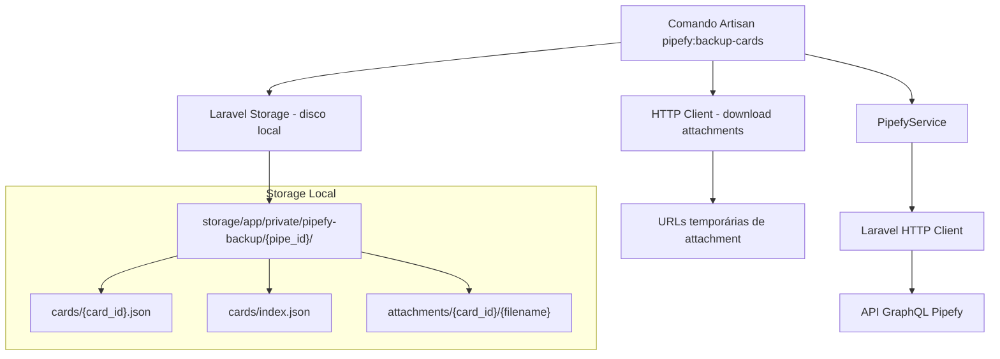
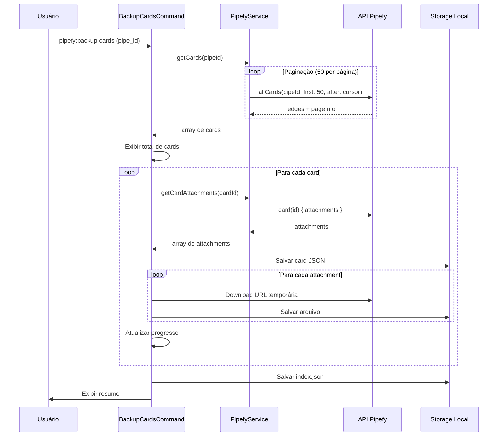

# Documento de Design

## Visão Geral

Este design descreve a implementação do backup de cards do Pipefy. A funcionalidade estende o `PipefyService` existente com dois novos métodos (`getCards` e `getCardAttachments`) e adiciona um novo comando Artisan `pipefy:backup-cards` que orquestra o processo de backup completo.

O fluxo principal é:

1. O comando recebe um `pipe_id` como argumento
2. Busca todos os cards do pipe via paginação cursor-based (máx. 50 por página)
3. Para cada card, consulta os attachments via query separada
4. Salva os dados de cada card como JSON individual no storage local
5. Faz download dos arquivos de attachment e salva localmente
6. Gera um arquivo `index.json` com o resumo do backup
7. Exibe progresso e resumo no terminal

O storage local utiliza o disco `local` do Laravel (root: `storage/app/private`), com a estrutura `pipefy-backup/{pipe_id}/cards/` e `pipefy-backup/{pipe_id}/attachments/{card_id}/`.

## Arquitetura



O fluxo detalhado:



## Componentes e Interfaces

### 1. PipefyService - Novos Métodos (`app/Services/PipefyService.php`)

Estender o serviço existente com dois novos métodos públicos:

```php
/**
 * Retorna todos os cards de um pipe, com paginação automática.
 *
 * @param  int  $pipeId
 * @return array<int, array<string, mixed>>
 *
 * @throws PipefyApiException
 */
public function getCards(int $pipeId): array

/**
 * Retorna os attachments de um card específico.
 *
 * @param  int  $cardId
 * @return array<int, array{id: string, filename: string, url: string, createdAt: string, path: string}>
 *
 * @throws PipefyApiException
 */
public function getCardAttachments(int $cardId): array
```

**`getCards(int $pipeId): array`**

- Executa a query `allCards` com `first: 50`
- Itera automaticamente usando cursor-based pagination (`after: endCursor`) enquanto `hasNextPage` for `true`
- Retorna array flat com todos os cards do pipe
- Cada card contém: id, title, assignees, comments, comments_count, current_phase, done, due_date, fields, labels, phases_history, url

Query GraphQL utilizada:

```graphql
query ($pipeId: ID!, $first: Int!, $after: String) {
    allCards(pipeId: $pipeId, first: $first, after: $after) {
        pageInfo {
            hasNextPage
            endCursor
        }
        edges {
            node {
                id
                title
                assignees {
                    id
                    name
                }
                comments {
                    text
                }
                comments_count
                current_phase {
                    name
                }
                done
                due_date
                fields {
                    name
                    value
                }
                labels {
                    name
                }
                phases_history {
                    phase {
                        name
                    }
                    firstTimeIn
                    lastTimeOut
                }
                url
            }
        }
    }
}
```

**`getCardAttachments(int $cardId): array`**

- Executa query para buscar attachments de um card específico
- Retorna array com os dados de cada attachment

Query GraphQL utilizada:

```graphql
query ($cardId: ID!) {
    card(id: $cardId) {
        attachments {
            id
            filename
            url
            createdAt
            path
        }
    }
}
```

### 2. Comando Artisan (`app/Console/Commands/PipefyBackupCardsCommand.php`)

```php
class PipefyBackupCardsCommand extends Command
{
    protected $signature = 'pipefy:backup-cards {pipe_id : ID do pipe para backup}';
    protected $description = 'Faz backup dos cards e attachments de um pipe do Pipefy';

    public function handle(PipefyService $pipefy): int
}
```

O método `handle()` orquestra o fluxo completo:

1. Obtém `pipe_id` do argumento
2. Chama `$pipefy->getCards($pipeId)` para buscar todos os cards
3. Exibe total de cards encontrados
4. Itera sobre cada card com barra de progresso:
   a. Consulta attachments via `$pipefy->getCardAttachments($cardId)`
   b. Salva dados do card como JSON (incluindo metadados de attachments)
   c. Faz download de cada attachment
   d. Trata erros individuais sem interromper o processo
5. Gera `index.json` com resumo
6. Exibe resumo final

**Tratamento de nomes duplicados de attachment:**

```php
private function resolveFilename(string $directory, string $filename): string
{
    $path = $directory . '/' . $filename;
    if (! Storage::disk('local')->exists($path)) {
        return $filename;
    }

    $name = pathinfo($filename, PATHINFO_FILENAME);
    $ext = pathinfo($filename, PATHINFO_EXTENSION);
    $counter = 1;

    do {
        $newFilename = $ext ? "{$name}_{$counter}.{$ext}" : "{$name}_{$counter}";
        $path = $directory . '/' . $newFilename;
        $counter++;
    } while (Storage::disk('local')->exists($path));

    return $newFilename;
}
```

**Download de attachments:**

Utiliza o HTTP Client do Laravel para fazer download das URLs temporárias. O download é feito via streaming para evitar problemas de memória com arquivos grandes:

```php
private function downloadAttachment(string $url, string $storagePath): void
{
    $response = Http::withOptions(['sink' => Storage::disk('local')->path($storagePath)])->get($url);

    if ($response->failed()) {
        throw new \RuntimeException("Download falhou: HTTP {$response->status()}");
    }
}
```

## Modelos de Dados

Não há modelos Eloquent. Os dados são representados como arrays associativos PHP.

### Estrutura de um Card (retornado por `getCards`)

```php
[
    'id' => '12345',
    'title' => 'Título do card',
    'assignees' => [['id' => '1', 'name' => 'João']],
    'comments' => [['text' => 'Comentário']],
    'comments_count' => 1,
    'current_phase' => ['name' => 'Em andamento'],
    'done' => false,
    'due_date' => '2025-01-15',
    'fields' => [['name' => 'Campo 1', 'value' => 'Valor 1']],
    'labels' => [['name' => 'Urgente']],
    'phases_history' => [
        [
            'phase' => ['name' => 'Inbox'],
            'firstTimeIn' => '2025-01-01T10:00:00Z',
            'lastTimeOut' => '2025-01-02T14:00:00Z',
        ],
    ],
    'url' => 'https://app.pipefy.com/pipes/123/cards/12345',
]
```

### Estrutura de um Attachment (retornado por `getCardAttachments`)

```php
[
    'id' => '67890',
    'filename' => 'documento.pdf',
    'url' => 'https://...temporary-url...',
    'createdAt' => '2025-01-10T08:30:00Z',
    'path' => '/uploads/documento.pdf',
]
```

### Estrutura do `index.json`

```php
[
    'pipe_id' => 123456,
    'backup_date' => '2025-07-15T10:30:00Z',
    'total_cards' => 25,
    'total_attachments_downloaded' => 42,
    'errors_count' => 2,
    'cards' => [
        ['id' => '12345', 'title' => 'Card 1'],
        ['id' => '12346', 'title' => 'Card 2'],
    ],
]
```

### Estrutura de Diretórios no Storage

```
storage/app/private/pipefy-backup/
└── {pipe_id}/
    ├── cards/
    │   ├── index.json
    │   ├── 12345.json
    │   └── 12346.json
    └── attachments/
        ├── 12345/
        │   ├── documento.pdf
        │   └── imagem.png
        └── 12346/
            └── planilha.xlsx
```

## Propriedades de Corretude

_Uma propriedade é uma característica ou comportamento que deve ser verdadeiro em todas as execuções válidas de um sistema — essencialmente, uma declaração formal sobre o que o sistema deve fazer. Propriedades servem como ponte entre especificações legíveis por humanos e garantias de corretude verificáveis por máquina._

### Propriedade 1: Agregação completa de paginação

_Para qualquer_ pipe com N cards distribuídos em múltiplas páginas (máx. 50 por página), `getCards()` deve retornar exatamente N cards, agregando todas as páginas automaticamente via cursor-based pagination.

**Valida: Requisitos 1.1, 1.2**

### Propriedade 2: Limite de página nas requisições

_Para qualquer_ chamada a `getCards()`, todas as requisições GraphQL enviadas à API devem conter o parâmetro `first` com valor 50.

**Valida: Requisitos 1.3**

### Propriedade 3: Completude dos dados do card

_Para qualquer_ card retornado pela API contendo os campos id, title, assignees, comments, comments_count, current_phase, done, due_date, fields, labels, phases_history e url, o resultado de `getCards()` deve preservar todos esses campos com valores equivalentes, incluindo campos customizados e histórico de fases.

**Valida: Requisitos 2.1, 2.2, 2.3**

### Propriedade 4: Completude dos dados de attachment

_Para qualquer_ attachment retornado pela API, `getCardAttachments()` deve retornar um array contendo os campos id, filename, url, createdAt e path com valores equivalentes aos da resposta da API.

**Valida: Requisitos 3.1**

### Propriedade 5: Round-trip de serialização JSON dos cards

_Para qualquer_ array de dados de card válido, salvar como JSON com `json_encode` e depois ler com `json_decode` deve produzir um valor equivalente ao original.

**Valida: Requisitos 5.4**

### Propriedade 6: Estrutura de caminhos no storage

_Para qualquer_ card com ID `C` de um pipe com ID `P`, o arquivo JSON deve ser salvo em `pipefy-backup/P/cards/C.json`. Para qualquer attachment com filename `F` do card `C`, o arquivo deve ser salvo em `pipefy-backup/P/attachments/C/F`.

**Valida: Requisitos 5.1, 6.1, 6.3**

### Propriedade 7: Completude do arquivo de índice

_Para qualquer_ conjunto de cards processados no backup, o `index.json` deve conter exatamente os mesmos IDs e títulos de todos os cards processados, sem omissões ou duplicatas.

**Valida: Requisitos 5.3**

### Propriedade 8: Resolução de nomes duplicados de attachment

_Para qualquer_ conjunto de attachments de um mesmo card com filenames duplicados, cada arquivo salvo deve ter um nome único. O primeiro mantém o nome original, os subsequentes recebem sufixo numérico incremental (`_1`, `_2`, etc.).

**Valida: Requisitos 6.4**

## Tratamento de Erros

| Cenário                                  | Ação                                                        | Interrompe processo? |
| ---------------------------------------- | ----------------------------------------------------------- | -------------------- |
| Pipe não encontrado / ID inválido        | Exibir erro, retornar `Command::FAILURE`                    | Sim                  |
| Falha de autenticação OAuth              | Exibir erro, retornar `Command::FAILURE`                    | Sim                  |
| Erro de conexão ao buscar cards          | Lançar `PipefyApiException`, exibir erro                    | Sim                  |
| Erro ao consultar attachments de um card | Registrar no log, exibir aviso, salvar card sem attachments | Não                  |
| Falha no download de um attachment       | Registrar no log, exibir aviso, continuar com próximo       | Não                  |
| Falha ao salvar arquivo no storage       | Registrar no log, exibir aviso, continuar                   | Não                  |

**Erros fatais** (interrompem o processo): falhas na busca de cards, autenticação, pipe inválido.

**Erros parciais** (não interrompem): falhas em attachments individuais ou consultas de attachment por card. O resumo final exibe a contagem de erros.

O comando mantém contadores internos:

- `$cardsSaved`: cards salvos com sucesso
- `$attachmentsDownloaded`: attachments baixados com sucesso
- `$errorsCount`: total de erros parciais

## Estratégia de Testes

### Abordagem

Utilizamos uma abordagem dual de testes:

- **Testes unitários (PHPUnit)**: Verificam exemplos específicos, edge cases e condições de erro
- **Testes de propriedade (PHPUnit com Faker)**: Verificam propriedades universais com múltiplas entradas geradas

Ambos são complementários e necessários para cobertura abrangente.

### Biblioteca de Testes

- **PHPUnit v11** para todos os testes
- **Faker** para geração de dados aleatórios nos testes de propriedade (mínimo 100 iterações)
- **Laravel HTTP Client Fake** para simular respostas da API GraphQL e downloads de attachments
- **Laravel Storage Fake** para simular o disco local nos testes

Cada teste de propriedade deve referenciar a propriedade do design com o formato:
**Feature: pipefy-cards-backup, Property {número}: {título}**

### Testes de Propriedade

| Propriedade | Descrição                          | Abordagem                                                                                               |
| ----------- | ---------------------------------- | ------------------------------------------------------------------------------------------------------- |
| 1           | Agregação de paginação             | Gerar N cards aleatórios, distribuir em páginas de 50, mockar API, verificar que getCards retorna todos |
| 2           | Limite de página                   | Interceptar requisições HTTP e verificar parâmetro `first: 50` em todas                                 |
| 3           | Completude dos dados do card       | Gerar cards com campos aleatórios, mockar API, verificar que todos os campos estão presentes no retorno |
| 4           | Completude dos dados de attachment | Gerar attachments aleatórios, mockar API, verificar campos no retorno                                   |
| 5           | Round-trip JSON                    | Gerar arrays de card aleatórios, json_encode + json_decode, verificar equivalência                      |
| 6           | Estrutura de caminhos              | Gerar pipe_id e card_id aleatórios, executar backup mockado, verificar caminhos no storage              |
| 7           | Completude do índice               | Gerar conjunto de cards, executar backup mockado, verificar index.json contém todos os IDs              |
| 8           | Resolução de duplicados            | Gerar attachments com nomes duplicados, executar resolveFilename, verificar unicidade                   |

### Testes Unitários

Focados em edge cases e exemplos específicos:

- Pipe com zero cards retorna coleção vazia (Requisito 1.4)
- Card com zero attachments retorna coleção vazia (Requisito 3.2)
- Erro de conexão durante paginação lança exceção (Requisito 1.5)
- Erro ao consultar attachments lança exceção (Requisito 3.3)
- Comando com pipe_id inválido retorna FAILURE (Requisito 4.6/7.4)
- Comando exibe total de cards encontrados (Requisito 4.3)
- Comando exibe resumo final com totais (Requisito 4.5)
- Comando continua após falha de download de attachment (Requisito 6.2/7.1)
- Comando salva card mesmo quando consulta de attachments falha (Requisito 7.2)
- Comando exibe contagem de erros no resumo (Requisito 7.3)
- JSON salvo com pretty-print (Requisito 5.2)
