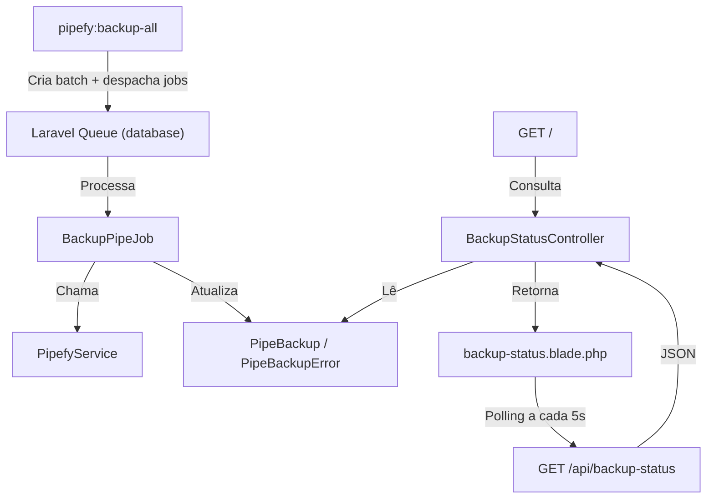

# Documento de Design: Backup Baseado em Filas

## Visão Geral

Refatorar o sistema de backup do Pipefy para que o comando `pipefy:backup-all` sempre despache jobs para a fila do Laravel, eliminando o modo síncrono. O `BackupPipeJob` existente será aprimorado com retentativas e rastreamento granular. Uma nova página Blade na raiz do projeto substituirá a welcome page e exibirá o status do batch mais recente com atualização automática via polling AJAX.

## Arquitetura



### Decisões de Design

1. **Eliminar modo síncrono do `pipefy:backup-all`**: O comando sempre despacha para fila. O modo direto (sem `--queue`) será removido para simplificar.
2. **Manter `BackupPipeJob` como job principal por pipe**: Cada pipe gera um job. Não subdividir em jobs por card — a complexidade adicional não justifica, pois o `PipefyBackupCardsCommand` já trata erros por card individualmente e registra em `PipeBackupError`.
3. **Usar polling AJAX simples**: Sem WebSockets ou broadcasting. Um endpoint JSON retorna o status do batch e o frontend faz polling a cada 5 segundos. Simples e funcional.
4. **Usar Laravel Job Batching**: Utilizar `Bus::batch()` para agrupar os jobs do batch, permitindo rastrear progresso nativo do Laravel e facilitar retentativas.
5. **Página Blade com Tailwind inline**: Sem dependência de build frontend. A página usará Tailwind via CDN ou estilos inline para funcionar sem `npm run build`.

## Componentes e Interfaces

### 1. PipefyBackupAllCommand (Refatorado)

- Remove a opção `--queue` (sempre despacha para fila)
- Adiciona opção `--retry` para reprocessar pipes com falha
- Cria registros `PipeBackup` com status "pending"
- Despacha `BackupPipeJob` para cada pipe via `Bus::batch()`

```php
// Assinatura
protected $signature = 'pipefy:backup-all {--retry : Reprocessar pipes com falha do último batch}';

// handle() - modo normal
public function handle(PipefyService $pipefy): int
{
    // 1. Buscar pipes da organização
    // 2. Criar batch_id
    // 3. Criar PipeBackup para cada pipe (status: pending)
    // 4. Despachar BackupPipeJob para cada pipe
    // 5. Exibir resumo
}

// handle() - modo retry
// 1. Buscar último batch_id
// 2. Filtrar PipeBackups com status failed/pending
// 3. Resetar status para pending
// 4. Redespachar BackupPipeJob para cada um
```

### 2. BackupPipeJob (Aprimorado)

- Adiciona `$tries` e `$backoff` para retentativas automáticas
- Implementa `failed()` para marcar PipeBackup como "failed" definitivamente
- Mantém a lógica de chamar `pipefy:backup-cards` via Artisan

```php
class BackupPipeJob implements ShouldQueue
{
    use Queueable;

    public int $tries = 3;
    public array $backoff = [30, 60, 120];

    public function __construct(
        public int $pipeBackupId,
        public int $pipeId,
    ) {}

    public function handle(): void { /* ... */ }

    public function failed(\Throwable $exception): void
    {
        // Marcar PipeBackup como failed definitivamente
    }
}
```

### 3. BackupStatusController (Novo)

- `index()`: Retorna view Blade com dados do batch mais recente
- `status()`: Retorna JSON com dados atualizados para polling AJAX

```php
class BackupStatusController extends Controller
{
    public function index(): View
    {
        $batchId = PipeBackup::latest()->value('batch_id');
        $backups = $batchId ? PipeBackup::where('batch_id', $batchId)->get() : collect();
        return view('backup-status', compact('backups', 'batchId'));
    }

    public function status(): JsonResponse
    {
        $batchId = PipeBackup::latest()->value('batch_id');
        $backups = $batchId ? PipeBackup::where('batch_id', $batchId)->get() : collect();
        return response()->json([
            'batch_id' => $batchId,
            'backups' => $backups,
            'summary' => [
                'total' => $backups->count(),
                'completed' => $backups->where('status', 'completed')->count(),
                'processing' => $backups->where('status', 'processing')->count(),
                'pending' => $backups->where('status', 'pending')->count(),
                'failed' => $backups->where('status', 'failed')->count(),
            ],
        ]);
    }
}
```

### 4. RetryFailedBackupsCommand ou opção --retry

Integrado no `pipefy:backup-all --retry`:

```php
// Busca último batch
$batchId = PipeBackup::latest()->value('batch_id');
$failedOrPending = PipeBackup::where('batch_id', $batchId)
    ->whereIn('status', ['failed', 'pending'])
    ->get();

foreach ($failedOrPending as $backup) {
    $backup->update(['status' => 'pending', 'error_message' => null]);
    BackupPipeJob::dispatch($backup->id, $backup->pipe_id);
}
```

### 5. View: backup-status.blade.php

Página Blade que substitui a welcome page na rota `/`. Exibe:

- Resumo do batch (barra de progresso, contadores)
- Tabela com cada pipe (nome, status, cards, attachments, erros)
- Mensagens de erro para pipes com falha
- Botão "Reprocessar Falhas" que faz POST para redespachar pipes com falha
- Auto-refresh via JavaScript polling a cada 5 segundos

## Modelos de Dados

### PipeBackup (Existente — sem alterações)

| Campo             | Tipo               | Descrição                              |
| ----------------- | ------------------ | -------------------------------------- |
| id                | bigint             | PK                                     |
| batch_id          | string(36)         | UUID do batch                          |
| pipe_id           | unsigned int       | ID do pipe no Pipefy                   |
| pipe_name         | string             | Nome do pipe                           |
| cards_count       | unsigned int       | Cards salvos                           |
| attachments_count | unsigned int       | Attachments baixados                   |
| errors_count      | unsigned int       | Erros encontrados                      |
| status            | string(20)         | pending, processing, completed, failed |
| error_message     | text nullable      | Mensagem de erro                       |
| started_at        | timestamp nullable | Início do processamento                |
| completed_at      | timestamp nullable | Fim do processamento                   |
| created_at        | timestamp          | Criação do registro                    |
| updated_at        | timestamp          | Última atualização                     |

### PipeBackupError (Existente — sem alterações)

| Campo          | Tipo                  | Descrição                                                 |
| -------------- | --------------------- | --------------------------------------------------------- |
| id             | bigint                | PK                                                        |
| pipe_backup_id | FK                    | Referência ao PipeBackup                                  |
| type           | string(30)            | Tipo do erro (api, attachment_query, attachment_download) |
| card_id        | unsigned int nullable | ID do card relacionado                                    |
| filename       | string nullable       | Nome do arquivo                                           |
| message        | text                  | Mensagem de erro                                          |

Não são necessárias migrações adicionais. Os modelos existentes já suportam todos os dados necessários.

</text>
</invoke>

## Propriedades de Corretude

_Uma propriedade é uma característica ou comportamento que deve ser verdadeiro em todas as execuções válidas de um sistema — essencialmente, uma declaração formal sobre o que o sistema deve fazer. Propriedades servem como ponte entre especificações legíveis por humanos e garantias de corretude verificáveis por máquina._

### Property 1: Despacho proporcional de jobs e registros

_Para qualquer_ conjunto de N pipes retornados pela API do Pipefy, ao executar o comando `pipefy:backup-all`, o sistema deve criar exatamente N registros PipeBackup com status "pending" e despachar exatamente N BackupPipeJobs.

**Validates: Requirements 1.1, 1.2**

### Property 2: Transição de status do BackupPipeJob

_Para qualquer_ PipeBackup com status "pending", quando o BackupPipeJob correspondente for processado com sucesso, o status deve transitar para "processing" (com started_at preenchido) e depois para "completed" (com completed_at preenchido). Quando falhar definitivamente, o status deve ser "failed" com error_message preenchido.

**Validates: Requirements 1.3, 2.1**

### Property 3: Retry reprocessa apenas pipes incompletos

_Para qualquer_ batch contendo PipeBackups com status variados (completed, failed, pending), ao executar `pipefy:backup-all --retry`, apenas os PipeBackups com status "failed" ou "pending" devem ser redespachados, e os PipeBackups com status "completed" devem permanecer inalterados. Os PipeBackups redespachados devem ter status resetado para "pending" e error_message nulo.

**Validates: Requirements 2.3, 2.4, 6.1, 6.2**

### Property 4: Isolamento de erros por card

_Para qualquer_ pipe com N cards onde M cards falham durante o backup, o sistema deve registrar M erros em PipeBackupError e salvar com sucesso os N-M cards restantes. O PipeBackup deve refletir as contagens corretas.

**Validates: Requirements 3.2, 3.3**

### Property 5: API de status reflete estado do banco

_Para qualquer_ conjunto de PipeBackups no banco de dados, o endpoint `/api/backup-status` deve retornar um JSON cujos contadores de resumo (total, completed, processing, pending, failed) correspondem exatamente às contagens reais no banco, e cada backup deve conter nome, status, cards_count, attachments_count, errors_count e error_message (quando failed).

**Validates: Requirements 4.2, 4.3, 4.4, 5.1, 5.3**

### Property 6: Atualização incremental de estatísticas

_Para qualquer_ pipe sendo processado, após cada card ser salvo com sucesso, o campo cards_count do PipeBackup correspondente deve ser incrementado. Após cada attachment baixado, attachments_count deve ser incrementado.

**Validates: Requirements 5.2**

## Tratamento de Erros

| Cenário                                     | Comportamento                                                              |
| ------------------------------------------- | -------------------------------------------------------------------------- |
| API do Pipefy indisponível ao listar pipes  | Comando exibe erro e retorna FAILURE                                       |
| API do Pipefy falha durante backup de cards | BackupPipeJob faz retry (até 3 tentativas com backoff 30s, 60s, 120s)      |
| Falha ao baixar attachment                  | Erro registrado em PipeBackupError, card continua sendo processado         |
| Falha definitiva do job (após 3 tentativas) | PipeBackup marcado como "failed", método `failed()` do job registra o erro |
| Nenhum pipe encontrado na organização       | Comando exibe mensagem informativa e retorna SUCCESS                       |
| Nenhum batch encontrado ao acessar página   | Página exibe mensagem "Nenhum backup encontrado"                           |

## Estratégia de Testes

### Testes Unitários (PHPUnit)

- Testar `BackupStatusController@index` retorna view correta com dados
- Testar `BackupStatusController@status` retorna JSON com estrutura esperada
- Testar comando `pipefy:backup-all` despacha jobs corretamente
- Testar comando `pipefy:backup-all --retry` reprocessa apenas falhas
- Testar `BackupPipeJob` atualiza status corretamente em sucesso e falha
- Testar edge case: retry quando não há falhas

### Testes de Propriedade (PHPUnit com geradores)

- Biblioteca: PHPUnit com data providers gerando dados aleatórios (sem dependência externa)
- Mínimo 100 iterações por propriedade
- Cada teste deve referenciar a propriedade do design
- Tag format: **Feature: queue-based-backup, Property {number}: {título}**

### Abordagem Dual

- Testes unitários: exemplos específicos, edge cases, condições de erro
- Testes de propriedade: propriedades universais com entradas geradas
- Ambos são complementares e necessários para cobertura abrangente
