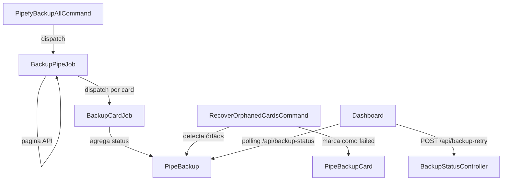

# Documento de Design

## Visão Geral

Este design aborda correções cirúrgicas no pipeline de backup existente para resolver os problemas críticos de confiabilidade. A abordagem é conservadora: corrigir o que está quebrado e adicionar mecanismos de recuperação, sem redesenhar a arquitetura. As mudanças principais são:

1. Ajustar `retry_after` na configuração da fila para acomodar jobs longos
2. Criar um comando Artisan para detectar e recuperar cards/pipes órfãos
3. Corrigir o schema da coluna `current_step`
4. Melhorar o dashboard com indicadores de alerta e tempo decorrido

## Arquitetura

O fluxo existente permanece o mesmo:



As mudanças são aditivas:

- Nova configuração de `retry_after` via variável de ambiente
- Novo comando `pipefy:recover-orphans` para limpeza de cards/pipes órfãos
- Nova migration para ampliar a coluna `current_step`
- Melhorias no controller e view do dashboard

## Componentes e Interfaces

### 1. Configuração da Fila (`config/queue.php`)

Alterar o `retry_after` do driver `database` para usar uma variável de ambiente com valor padrão de 3600 segundos (60 minutos):

```php
'database' => [
    'driver' => 'database',
    'connection' => env('DB_QUEUE_CONNECTION'),
    'table' => env('DB_QUEUE_TABLE', 'jobs'),
    'queue' => env('DB_QUEUE', 'default'),
    'retry_after' => (int) env('DB_QUEUE_RETRY_AFTER', 3600),
    'after_commit' => false,
],
```

O `.env` deve definir `DB_QUEUE_RETRY_AFTER=3600`.

**Justificativa**: O `retry_after` de 90 segundos é o padrão do Laravel, mas o `BackupPipeJob` pode levar vários minutos para paginar a API do Pipefy em pipes com 2000+ cards (50 cards por página = 40+ requisições HTTP). Com 90 segundos, o worker marca o job como abandonado e o re-despacha, causando duplicação e eventual falha por "too many attempts".

### 2. Comando de Recuperação de Órfãos (`app/Console/Commands/RecoverOrphanedCardsCommand.php`)

Novo comando Artisan `pipefy:recover-orphans` com as seguintes responsabilidades:

```php
// Signature
'pipefy:recover-orphans {--timeout=30 : Minutos sem atualização para considerar órfão}'

// Lógica principal:
// 1. Buscar PipeBackupCards com status "processing" e updated_at < now() - timeout
// 2. Marcar como "failed" com mensagem "Job considerado órfão após {timeout} minutos sem atualização"
// 3. Para cada PipeBackup afetado, recalcular status agregado
// 4. Buscar PipeBackups com status "processing" sem cards em "pending" ou "processing"
//    e que não foram atualizados há mais de {timeout} minutos
// 5. Forçar conclusão desses PipeBackups
```

A lógica de recálculo de status do PipeBackup já existe em `BackupCardJob::aggregatePipeBackupStatus()`. Devemos extrair essa lógica para um método reutilizável no modelo `PipeBackup` ou em um service.

**Extração de `aggregatePipeBackupStatus`**:

Mover a lógica de `BackupCardJob::aggregatePipeBackupStatus()` para `PipeBackup::recalculateStatus()`:

```php
// PipeBackup.php
public function recalculateStatus(): void
{
    $cards = $this->backupCards();

    $this->update([
        'cards_count' => (clone $cards)->whereIn('status', ['completed', 'completed_with_errors'])->count(),
        'attachments_count' => (clone $cards)->sum('attachments_count'),
        'errors_count' => (clone $cards)->sum('errors_count'),
    ]);

    $pendingOrProcessing = (clone $cards)->whereIn('status', ['pending', 'processing'])->count();

    if ($pendingOrProcessing === 0) {
        $hasFailed = (clone $cards)->where('status', 'failed')->exists();
        $this->update([
            'status' => $hasFailed ? 'completed_with_errors' : 'completed',
            'completed_at' => now(),
        ]);
    }
}
```

O `BackupCardJob` passa a chamar `$pipeBackup->recalculateStatus()` em vez de manter a lógica duplicada.

### 3. Migration para Ampliar `current_step`

Nova migration para alterar a coluna:

```php
Schema::table('pipe_backups', function (Blueprint $table) {
    $table->string('current_step', 255)->nullable()->change();
});
```

### 4. Melhorias no Dashboard

#### Controller (`BackupStatusController`)

Adicionar ao JSON de resposta do endpoint `/api/backup-status`:

- `started_at` já está disponível no modelo
- Calcular `elapsed_seconds` para pipes em processamento: `now()->diffInSeconds($backup->started_at)`
- Flag `is_stale` para pipes em "processing" sem atualização há mais de 30 minutos

```php
// No método status(), para cada backup:
'elapsed_seconds' => $backup->started_at
    ? now()->diffInSeconds($backup->started_at)
    : null,
'is_stale' => $backup->status === 'processing'
    && $backup->updated_at->diffInMinutes(now()) > 30,
```

#### View (`backup-status.blade.php`)

- Exibir tempo decorrido formatado (ex: "12m 34s") para pipes em processamento
- Indicador visual de alerta (borda amarela/vermelha) para pipes com `is_stale = true`
- Feedback visual ao clicar no botão de retry (spinner, mensagem de confirmação)

### 5. Retry Inteligente

A lógica de retry no `BackupStatusController::retry()` já diferencia entre pipes que falharam no nível do pipe (sem cards) e pipes com cards individuais que falharam. A implementação atual está correta para o requisito 6. Apenas garantir que:

- Pipes com `status = 'failed'` e sem PipeBackupCards → redespachar `BackupPipeJob`
- Pipes com PipeBackupCards com `status = 'failed'` → redespachar apenas esses `BackupCardJob`

A implementação atual no controller já faz isso. Nenhuma mudança estrutural necessária, apenas garantir que o comando `pipefy:backup-all --retry` também siga a mesma lógica.

## Modelos de Dados

### Alterações no Schema

#### Tabela `pipe_backups`

| Coluna         | Tipo Atual   | Tipo Novo     | Motivo                                      |
| -------------- | ------------ | ------------- | ------------------------------------------- |
| `current_step` | `string(50)` | `string(255)` | Suportar mensagens de progresso mais longas |

Nenhuma nova tabela é necessária. Os modelos existentes (`PipeBackup`, `PipeBackupCard`, `PipeBackupError`) são suficientes.

### Novo Método no Modelo `PipeBackup`

```php
public function recalculateStatus(): void
```

Move a lógica de agregação de status que hoje vive em `BackupCardJob::aggregatePipeBackupStatus()` para o modelo, tornando-a reutilizável pelo comando de recuperação e pelo controller de retry.

### Configuração

Nova variável de ambiente:

| Variável               | Valor Padrão | Descrição                                               |
| ---------------------- | ------------ | ------------------------------------------------------- |
| `DB_QUEUE_RETRY_AFTER` | `3600`       | Tempo em segundos antes de considerar um job abandonado |

## Propriedades de Corretude

_Uma propriedade é uma característica ou comportamento que deve ser verdadeiro em todas as execuções válidas de um sistema — essencialmente, uma declaração formal sobre o que o sistema deve fazer. Propriedades servem como ponte entre especificações legíveis por humanos e garantias de corretude verificáveis por máquina._

### Property 1: Falha do job marca PipeBackup como failed

_Para qualquer_ PipeBackup em status "processing", quando o método `failed()` do BackupPipeJob for invocado com uma exceção, o PipeBackup correspondente deve ter status "failed" e uma mensagem de erro não vazia.

**Validates: Requirements 1.3**

### Property 2: Comando de recuperação marca apenas cards órfãos

_Para qualquer_ conjunto de PipeBackupCards com diferentes status e timestamps, quando o comando de recuperação for executado com um timeout de T minutos, apenas os cards com status "processing" e `updated_at` anterior a `now() - T minutos` devem ser marcados como "failed". Cards com outros status ou com `updated_at` recente devem permanecer inalterados.

**Validates: Requirements 2.1, 2.2, 5.1, 5.2**

### Property 3: Recálculo de status agregado do PipeBackup

_Para qualquer_ PipeBackup com um conjunto de PipeBackupCards em estados terminais (completed, completed_with_errors, failed), o método `recalculateStatus()` deve:

- Definir `cards_count` como a soma de cards com status "completed" ou "completed_with_errors"
- Definir o status do PipeBackup como "completed" se não houver cards com status "failed", ou "completed_with_errors" se houver pelo menos um card com status "failed"
- Não alterar o status se ainda houver cards em "pending" ou "processing"

**Validates: Requirements 2.3, 5.3**

### Property 4: Persistência round-trip de current_step

_Para qualquer_ string de até 255 caracteres, ao salvar no campo `current_step` de um PipeBackup e depois ler o registro do banco, o valor lido deve ser idêntico ao valor salvo.

**Validates: Requirements 3.1, 3.2**

### Property 5: Retry inteligente redespacha apenas cards com falha

_Para qualquer_ PipeBackup com uma mistura de PipeBackupCards em status "completed", "completed_with_errors" e "failed", quando o retry for executado, apenas os cards com status "failed" devem ter seu status resetado para "pending" e ter jobs despachados. Cards com status "completed" ou "completed_with_errors" devem permanecer inalterados.

**Validates: Requirements 6.1, 6.3**

### Property 6: Campos calculados da API de status

_Para qualquer_ PipeBackup em status "processing" com `started_at` definido, a resposta da API `/api/backup-status` deve incluir `elapsed_seconds` como um inteiro não negativo e `is_stale` como booleano verdadeiro quando `updated_at` for anterior a 30 minutos atrás.

**Validates: Requirements 7.2, 7.3**

### Property 7: Contagens de cards por status na API

_Para qualquer_ PipeBackup com PipeBackupCards em diferentes status, a resposta da API `/api/backup-status` deve retornar `card_status_summary` com contagens que somam exatamente o total de PipeBackupCards do pipe.

**Validates: Requirements 4.2**

## Tratamento de Erros

### Erros de Timeout da Fila

- O `retry_after` de 3600s garante que o worker não re-despacha jobs prematuramente
- O `retryUntil()` do BackupPipeJob continua retornando `now()->addMinutes(60)`, compatível com o novo `retry_after`
- Se o job exceder 60 minutos, o método `failed()` marca o PipeBackup como "failed"

### Erros de Cards Órfãos

- O comando `pipefy:recover-orphans` pode ser agendado via cron (ex: a cada hora)
- Cards em "processing" há mais de 30 minutos (configurável) são marcados como "failed"
- O recálculo de status do PipeBackup pai é feito automaticamente

### Erros de Retry

- Se o retry falhar ao despachar um job, a exceção é capturada e retornada como JSON 500
- Cards que falharam no retry mantêm o status "failed" original até serem redespachados com sucesso

### Erros de Migration

- A migration usa `->change()` que requer o pacote `doctrine/dbal` ou Laravel 11+ (que suporta nativamente)
- A migration é reversível: o rollback volta para `string(50)`

## Estratégia de Testes

### Framework

- Pest PHP v3 (já instalado no projeto)
- Executar com `php artisan test --compact`

### Testes de Propriedade (Property-Based Tests)

Cada propriedade de corretude será implementada como um teste de propriedade usando o Pest com dados gerados aleatoriamente. Mínimo de 100 iterações por teste.

Cada teste deve ser anotado com um comentário referenciando a propriedade do design:

```
// Feature: reliable-backup-pipeline, Property N: {título da propriedade}
```

### Testes Unitários

Testes unitários complementam os testes de propriedade para cobrir:

- Edge cases: comando sem órfãos, retry sem falhas, pipe sem cards
- Integração: endpoint da API retorna JSON válido
- Configuração: `retry_after` está configurado corretamente

### Abordagem de Testes por Componente

| Componente                         | Tipo de Teste              | Foco                          |
| ---------------------------------- | -------------------------- | ----------------------------- |
| `PipeBackup::recalculateStatus()`  | Property test              | Corretude do cálculo agregado |
| `RecoverOrphanedCardsCommand`      | Property test + edge cases | Detecção correta de órfãos    |
| `BackupStatusController::retry()`  | Property test              | Seletividade do retry         |
| `BackupStatusController::status()` | Property test              | Campos calculados e contagens |
| Migration `current_step`           | Property test              | Round-trip de persistência    |
| `BackupPipeJob::failed()`          | Property test              | Marcação correta de falha     |
| `config/queue.php`                 | Unit test                  | Valor de retry_after          |
